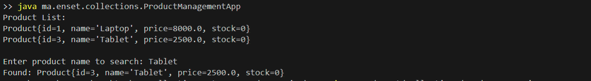
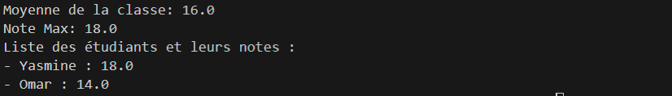
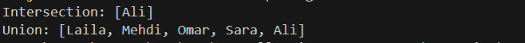
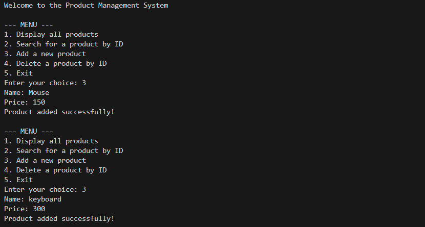
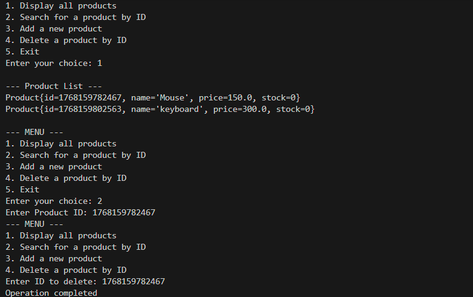

#  Java TP: Collections, Streams & Generics (OOP)

* **Full Name:** Majri Salma
* **Supervised by:** Mme Loubna Aminou

------------------------------------------------

### 1. Product Management (Lists & CRUD)
Testing the addition, search, and deletion of products.

### 2. Grade Management (Maps & Streams)
Calculating the class average and displaying max/min grades.

### 3. Group Management (Sets)
Demonstrating union and intersection between two student groups.

### 4. Interactive Menu (Generics & OOP)
Console interface for managing generic storage:
* 
* 
* 
